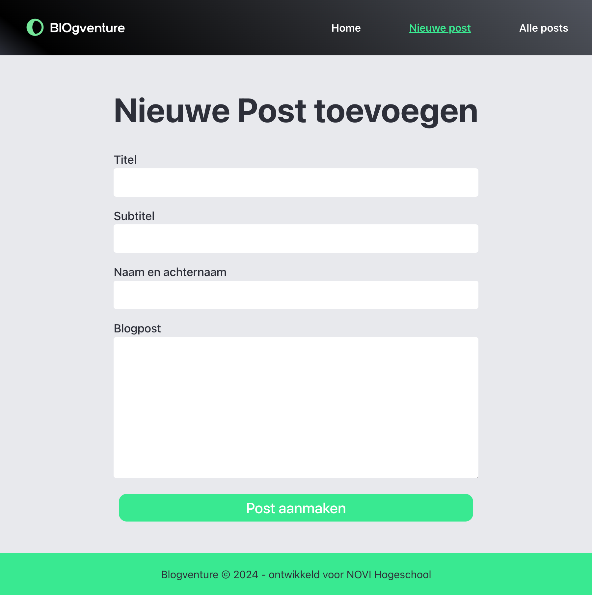

# 📝 Blog Platform – NOVI Frontend Module

This repository contains my solution for the Blog Application assignment from the Frontend Development module at [Novi University](https://www.novi.nl).  
The goal of this project is to practice React Router, dynamic routing, state management, and forms by building a functional blog platform with multiple pages, data-driven content, and user interaction.

---

## Table of Contents

- [Tech Stack](#tech-stack)
- [Key Features](#key-features)
- [Preview](#preview)
- [Project Setup](#project-setup)
- [Credits](#credits)
- [License](#license)

---

## Tech Stack

- **React** (v18.2.0)
- **Vite**
- **Axios** (for API requests)
- **HTML5**
- **CSS3**
- **JavaScript ES6+**
- **Node.js** & **NPM**

---

## Key Features

### 📍 Routing & Navigation
- Four static pages:
    1. Home
    2. All Posts (overview)
    3. New Post (form)
    4. 404 (catch invalid routes)

- Dynamic blog detail page accessible via /posts/:id.
- Navigation bar displayed on all pages with active link highlighting.

### 📚 Blog Overview Page
- Displays the total number of posts.
- Lists all blog posts in the format:
  The Tastes of Italy (Anna de Kok)  
  12 comments – 8 shares

### 📰 Blog Detail Page
- Renders all details of a single post:
    - Title, read time, subtitle, content, author, and created date.
    - Comments and shares count.
- Includes a helper function to format dates (e.g., "2023-09-20T11:45:00Z" → "21 September 2023").
- Provides a link back to the overview page.

### ✍️ New Post Form
- Controlled form with fields for: Title - Subtitle - Author - Content (300–2000 characters)
- Validation ensures all fields are filled correctly.
- After submission, the user is redirected to the overview page.

---

## Preview

<details>
<summary><strong>Home</strong></summary>


</details>

<details>
<summary><strong>Blogpost Overview</strong></summary>


</details>

<details>
<summary><strong>New Blogpost</strong></summary>


</details>


> This screenshot shows the Blogpost Detail Page. The page displays the full content of a single blogpost, including the title, subtitle, author, creation date, estimated reading time, and the full article text.


---

## Project Setup

1. Clone or open the repository in an IDE

2. Install dependencies
   ```bash
   npm install
   ```
3. Start the development server
   ```bash
   npm run dev
   ```
4. Open your browser at http://localhost:5173 to view the app.


## Credits

> This assignment, visual designs and base project setup were created and provided by **Novi University** as part of the Frontend module.

---

## License

> "This project is for **educational purposes only**. All images, designs, and dummy content are to be used for learning and non-commercial use."

---